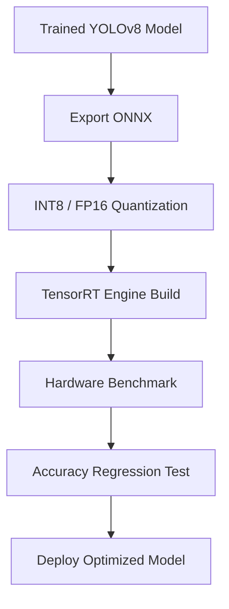
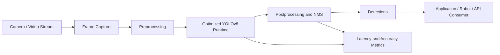

# VisiOln — Custom Object Detection MLOps Pipeline

## Overview

The **YOLOv8 Real-Time Object Detection Framework** is a reusable production-grade object detection pipeline for custom datasets. It supports data annotation, augmentation, training, evaluation, optimization, deployment, and feedback-driven improvement.

The framework achieved approximately 90% detection accuracy on custom datasets and reduced inference time by approximately 45% through model quantization and TensorRT optimization.

<hr>

<table>
  <tr>
    <td align="center" valign="top" width="25%">
      <a href="video_inference/singlestream_objectdetection_yolo26/README.md"><b>YOLO26</b></a>
      <a href="https://developer.memryx.com/tutorials/realtime_inf/realtime_od.html">📝</a><br/>
      <a href="video_inference/singlestream_objectdetection_yolo26/README.md">
        
      </a><br/>
      <sub>COCO object detection</sub><br/>
      <sub>Model: YOLO26 (nano)</sub><br/>
      
      
    </td>
    <!-- new cell -->
    <td align="center" valign="top" width="25%">
      <a href="video_inference/object_detection_yolo11_mxprepost/README.md"><b>YOLO11</b></a>
      <a href="https://developer.memryx.com/tutorials/realtime_inf/mxprepost.html">📝</a><br/>
      <a href="video_inference/object_detection_yolo11_mxprepost/README.md">
        
      </a><br/>
      <sub>COCO object detection with MxPrepost library</sub><br/>
      <sub>Model: YOLO11 (small)</sub><br/>
      
      
    </td>
    <!-- new cell -->
    <td align="center" valign="top" width="25%">
      <a href="video_inference/object_detection_yolox/README.md"><b>YoloX</b></a><br/>
      <a href="video_inference/object_detection_yolox/README.md">
        
      </a><br/>
      <sub>COCO object detection</sub><br/>
      <sub>Model: YoloX (Medium)</sub><br/>
      
      
    </td>
    <!-- new cell -->
    <td align="center" valign="top" width="25%">
      <a href="video_inference/vehicle_detection/README.md"><b>Vehicle Detection</b></a><br/>
      <a href="video_inference/vehicle_detection/README.md">
        
      </a><br/>
      <sub>Vehicle detection</sub><br/>
      <sub>Model: Vehicle-Detection-0200</sub><br/>
      
      
    </td>
  </tr>
  <!-- new row -->
  <tr>
    <td align="center" valign="top" width="25%">
      <a href="video_inference/segmentation_yolov8/README.md"><b>YOLOv8 Segmentation</b></a><br/>
      <a href="video_inference/segmentation_yolov8/README.md">
        
      </a><br/>
      <sub>Instance segmentation</sub><br/>
      <sub>Model: YOLOv8 Nano Segmentation</sub><br/>
      
      
      
    </td>
    <!-- new cell -->
    <td align="center" valign="top" width="25%">
      <a href="video_inference/pose_estimation_yolov8/README.md"><b>YOLOsv8 Pose</b></a>
      <a href="https://developer.memryx.com/tutorials/realtime_inf/realtime_pose.html">📝</a><br/>
      <a href="video_inference/pose_estimation_yolov8/README.md">
        
      </a><br/>
      <sub>Human pose estimation</sub><br/>
      <sub>Model: YOLOv8 (Medium)</sub><br/>
      
      
      
      
    </td>
    <!-- new cell -->
    <td align="center" valign="top" width="25%">
      <a href="video_inference/depth_midas/README.md"><b>MiDaS Depth</b></a>
      <a href="https://developer.memryx.com/tutorials/realtime_inf/realtime_depth.html">📝</a><br/>
      <a href="video_inference/depth_midas/README.md">
        
      </a><br/>
      <sub>Monocular depth estimation</sub><br/>
      <sub>Model: MiDaS</sub><br/>
      
      
      
      
    </td>
    <!-- new cell -->
    <td align="center" valign="top" width="25%">
      <a href="video_inference/pointcloud_from_depth/README.md"><b>Depth to 3D</b></a><br/>
      <a href="video_inference/pointcloud_from_depth/README.md">
        
      </a><br/>
      <sub>Point cloud from depth</sub><br/>
      <sub>Model: MiDaS</sub><br/>
      
      
      
    </td>
  </tr>
  <!-- new row -->
  <tr>
    <td align="center" valign="top" width="25%">
      <a href="video_inference/face_emotion_detection/README.md"><b>Face + Emotion</b></a>
      <a href="https://developer.memryx.com/tutorials/realtime_inf/realtime_multimodel.html">📝</a><br/>
      <a href="video_inference/face_emotion_detection/README.md">
        
      </a><br/>
      <sub>Face + emotion classification</sub><br/>
      <sub>Multiple Models</sub><br/>
      
      
      
    </td>
    <!-- new cell -->
    <td align="center" valign="top" width="25%">
      <a href="video_inference/realtime_facelandmark_detection/README.md"><b>Face Landmarks</b></a><br/>
      <a href="video_inference/realtime_facelandmark_detection/README.md">
        
      </a><br/>
      <sub>Facial landmark tracking</sub><br/>
      <sub>Model: BlazeFace & FaceMesh</sub><br/>
      
      
    </td>
    <!-- new cell -->
    <td align="center" valign="top" width="25%">
      <a href="video_inference/mediapipe_hands/README.md"><b>Mediapipe Hands</b></a><br/>
      <a href="video_inference/mediapipe_hands/README.md">
        
      </a><br/>
      <sub>Hand landmark tracking</sub><br/>
      <sub>Models: PalmDet &amp; HandPose</sub><br/>
      
      
      
    </td>
    <!-- new cell -->
    <td align="center" valign="top" width="25%">
      <a href="video_inference/wireframe/README.md"><b>Wireframe</b></a><br/>
      <a href="video_inference/wireframe/README.md">
        
      </a><br/>
      <sub>Line / wireframe detection</sub><br/>
      <sub>Model: M-LSD (Large)</sub><br/>
      
      
    </td>
  </tr>
  <!-- new row -->
  <tr>
    <td align="center" valign="top" width="25%">
      <a href="video_inference/traffic_analysis/README.md"><b>Traffic Analysis</b></a><br/>
      <a href="video_inference/traffic_analysis/README.md">
        
      </a><br/>
      <sub>Oriented bounding boxes detection</sub><br/>
      <sub>Model: YOLOv8s-OBB</sub><br/>
      
      
    </td>
    <!-- new cell -->
    <td align="center" valign="top" width="25%">
      <a href="video_inference/football_cv/README.md"><b>FootballCV</b></a><br/>
      <a href="video_inference/football_cv/README.md">
        
      </a><br/>
      <sub>Football Video Analysis</sub><br/>
      <sub>Models: Yolov8 (small)</sub><br/>
      
      
      
    </td>
    <!-- new cell -->
    <td align="center" valign="top" width="25%">
      <a href="video_inference/luggage_counting_yolov8/README.md"><b>Luggage counting</b></a><br/>
      <a href="video_inference/luggage_counting_yolov8/README.md">
        
      </a><br/>
      <sub>COCO object detection</sub><br/>
      <sub>Model: YOLOv8 (Nano)</sub><br/>
      
      
    </td>
    <!-- new cell -->
    <td align="center" valign="top" width="25%">
      <a href="video_inference/ppe_detection_tracking_yolov8/README.md"><b>PPE Detection</b></a><br/>
      <a href="video_inference/ppe_detection_tracking_yolov8/README.md">
        
      </a><br/>
      <sub>Personal protective equipment detection</sub><br/>
      <sub>Model: YOLOv8 (Nano)</sub><br/>
      
      
    </td>
  </tr>
  <!-- new row -->
  <tr>
    <td align="center" valign="top" width="25%">
      <a href="video_inference/object_blurring_yolov8/README.md"><b>Object Blurring</b></a><br/>
      <a href="video_inference/object_blurring_yolov8/README.md">
        
      </a><br/>
      <sub>Blur detected persons with YOLOv8</sub><br/>
      <sub>Model: YOLOv8 (Small)</sub><br/>
      
      
    </td>
    <!-- new cell -->
    <td align="center" valign="top" width="25%">
      <a href="video_inference/object_tracking_yolov8/README.md"><b>Object Tracking</b></a><br/>
      <a href="video_inference/object_tracking_yolov8/README.md">
        
      </a><br/>
      <sub>Number and track objects with YOLOv8 and SuperVision tracking</sub><br/>
      <sub>Model: YOLOv8 (Small)</sub><br/>
      
      
    </td>
    <!-- new cell -->
    <td align="center" valign="top" width="25%">
      <a href="video_inference/realtime_multiface_recognition/README.md"><b>Multi-Face ID</b></a><br/>
      <a href="video_inference/realtime_multiface_recognition/README.md">
        
      </a><br/>
      <sub>Interactive multi-face recognition</sub><br/>
      <sub>Multiple Models</sub><br/>
      
      
    </td>
    <!-- new cell -->
    <td align="center" valign="top" width="25%">
      <a href="video_inference/singlestream_peopletracking_yolo26/README.md"><b>Person Tracking</b></a><br/>
      <a href="video_inference/singlestream_peopletracking_yolo26/README.md">
        
      </a><br/>
      <sub>Person tracking + IDs using</sub><br/>
      <sub>simple Kalman filters</sub><br/>
      <sub>Model: YOLO26 (nano)</sub><br/>
      
      
    </td>
  </tr>
  <!-- new row -->
  <tr>
    <td align="center" valign="top" width="25%">
      <a href="video_inference/intrusion_detection/README.md"><b>Intrusion Detection</b></a><br/>
      <a href="video_inference/intrusion_detection/README.md">
        
      </a><br/>
      <sub>ROI intrusion alerts</sub><br/>
      <sub>Models: Yolov8 &amp; ByteTrack</sub><br/>
      
      
    </td>
    <!-- new cell -->
    <td align="center" valign="top" width="25%">
      <a href="video_inference/rtmpose_estimate/README.md"><b>Rtmpose Estimate</b></a><br/>
      <a href="video_inference/rtmpose_estimate/README.md">
        
      </a><br/>
      <sub>Pose Estimate with tracking</sub><br/>
      <sub>Models: Yolox &amp; Rtmpose</sub><br/>
      
      
    </td>
    <!-- new cell -->
    <td align="center" valign="top" width="25%">
      <a href="video_inference/parking_management_yolov8/README.md"><b>Parking Management</b></a><br/>
      <a href="video_inference/parking_management_yolov8/README.md">
        
      </a><br/>
      <sub>Parking management system</sub><br/>
      <sub>Models: Yolov8</sub><br/>
      
      
    </td>
    <!-- new cell -->
    <td align="center" valign="top" width="25%">
      <a href="video_inference/fire_smoke_detection_yolo11/README.md"><b>Fire &amp; Smoke Detection</b></a><br/>
      <a href="video_inference/fire_smoke_detection_yolo11/README.md">
        
      </a><br/>
      <sub>Real-time fire and smoke detection alerts</sub><br/>
      <sub>Model: YOLO11 (Nano)</sub><br/>
      
      
    </td>
  </tr>
</table>


---
## Core Capabilities

- End-to-end YOLOv8 object detection lifecycle
- Custom dataset preparation and annotation
- Data augmentation and class balancing
- Model training and evaluation
- Quantization and TensorRT acceleration
- Optimized real-time serving
- Robotics perception transfer
- Reusable MLOps structure for future CV projects

## Technology Stack

| Layer | Technology |
|-------|------------|
| Model | YOLOv8 |
| CV Runtime | OpenCV |
| Training | Python, PyTorch, Ultralytics-style training workflow |
| Optimization | Quantization, TensorRT |
| MLOps | Experiment tracking, model registry, evaluation reports |
| Serving | REST/gRPC inference service, edge runtime |

## End-to-End MLOps Architecture

```mermaid
flowchart LR
    Raw[Raw Images / Videos]
    Label[Annotation Tool]
    Dataset[Versioned Dataset]
    Aug[Augmentation Pipeline]
    Train[YOLOv8 Training]
    Eval[Evaluation and Error Analysis]
    Registry[Model Registry]
    Optimize[Quantization and TensorRT]
    Serve[Inference Service]
    Monitor[Runtime Monitoring]
    Feedback[Feedback Samples]

    Raw --> Label
    Label --> Dataset
    Dataset --> Aug
    Aug --> Train
    Train --> Eval
    Eval --> Registry
    Registry --> Optimize
    Optimize --> Serve
    Serve --> Monitor
    Monitor --> Feedback
    Feedback --> Dataset
```



## Pipeline Stages

### 1. Data Collection

Responsibilities:

- Collect images and videos under diverse lighting and environmental conditions
- Include edge cases such as blur, occlusion, partial objects, and unusual viewpoints
- Maintain class distribution metadata

### 2. Annotation

Responsibilities:

- Label bounding boxes for target objects
- Validate label consistency
- Maintain train, validation, and test splits
- Track annotation quality metrics

Example YOLO format:

```text
<class_id> <x_center> <y_center> <width> <height>
```

### 3. Data Augmentation

Augmentation techniques:

- Random brightness and contrast
- Rotation and scaling
- Mosaic augmentation
- Blur and noise injection
- Horizontal flip where semantically valid
- Cropping and perspective transformation

### 4. Training

Responsibilities:

- Train YOLOv8 models on custom datasets
- Track hyperparameters, metrics, and model artifacts
- Compare model variants by accuracy and latency
- Export best-performing checkpoints

Suggested tracked metrics:

```text
mAP50
mAP50-95
precision
recall
F1 score
inference latency
FPS
model size
false positive rate
false negative rate
```

### 5. Evaluation

Responsibilities:

- Validate model accuracy on held-out data
- Generate confusion matrix
- Analyze failure cases
- Identify class imbalance and annotation errors
- Select deployment candidate based on accuracy-latency tradeoff

### 6. Optimization

Responsibilities:

- Apply quantization
- Export to ONNX or TensorRT runtime
- Benchmark latency on target hardware
- Validate optimized model accuracy against baseline

Optimization flow:



### 7. Serving

Serving options:

| Mode | Use Case |
|------|----------|
| Python batch inference | Offline evaluation and data processing |
| REST API | Web and backend integration |
| gRPC service | High-throughput low-latency inference |
| Edge runtime | Robotics, IoT, and local camera streams |
| ROS2 node | Robotics perception pipeline |

## Runtime Serving Architecture



## Robotics Transfer Design

The framework can be reused for robotics perception by wrapping optimized inference in ROS2 nodes.

Suggested ROS2 topics:

```text
/camera/image_raw
/detector/objects
/detector/debug_image
/detector/inference_stats
```

Example detection message:

```json
{
  "class_name": "object",
  "confidence": 0.93,
  "bbox": [100, 120, 240, 320],
  "timestamp": "2026-01-01T12:00:00Z"
}
```

## Quality Gates

A model should pass the following checks before deployment:

- Accuracy threshold on validation and test datasets
- Latency threshold on target hardware
- No severe class-level regression
- Acceptable false-positive and false-negative profile
- Successful export and optimized runtime validation
- Reproducible training configuration

---
